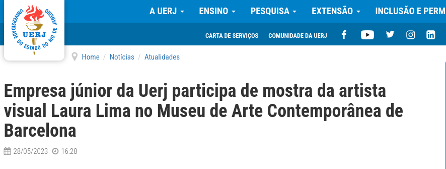

# Laura Lima's Balet Literal
### Barcelona May, 2023 - September, 2023

[Access here the article](https://www.uerj.br/noticia/empresa-junior-da-uerj-participa-de-mostra-da-artista-visual-laura-lima-no-museu-de-arte-contemporanea-de-barcelona/)

This project was made in order to develop the software of six mechanical artistic sculptures.

## Basic Structure of this directory

- peca1: Code developed to the first sculpture
- peca2: Code developed to the second sculpture
- peca3: Code developed to the third sculpture
- peca4: Code developed to the fourth sculpture
- peca5: Code developed to the fifth sculpture
- peca6: Code developed to the sixth sculpture
- infrared: Contains the folders with the specific codes to both infrared receiver and transmitter that are going to be incorporated into the components' codes.

## Autores

- [@kauanpecanha](https://www.github.com/kauanpecanha): Serra Jr. Engenharia's Software Engineer - Project Manager

- [@Fellipz1](https://www.github.com/Fellipz1): Serra  Jr. Engenharia's Mechanical Engineer

- [@ViniciusCMB](https://www.github.com/ViniciusCMB): Serra  Jr. Engenharia's Mechanical Engineer